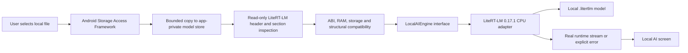

# NEXUS OFFLINE — Local AI Architecture (2026-10-04)

The app uses **LiteRT-LM Android 0.17.1 on CPU** as its on-device inference runtime. Model weights are selected by the user from local storage; they are never downloaded automatically, and there is no remote inference endpoint, prompt upload, API-key requirement, or fabricated fallback answer.

## Runtime choice and device fit

The project targets `minSdk 24`. Direct inspection of the resolved `litertlm-android:0.17.1` AAR found an Android manifest minimum of API 24 and native libraries for `arm64-v8a` and `x86_64`; the adapter enables only those two ABIs. This confirms the declared artifact metadata and packaging, **not** that every API-24 phone has been exercised. For the required ARM64 case, the selected artifact includes `arm64-v8a/liblitertlm_jni.so`.

LiteRT-LM is the best fit among the reviewed choices because Google provides a Kotlin Android API, a local `.litertlm` model path, asynchronous streamed response callbacks, and CPU/GPU/NPU backends. This integration deliberately chooses `Backend.CPU()` to avoid optional GPU libraries and vendor-specific NPU setup. Google's [Android guide](https://developers.google.com/edge/litert-lm/android) warns that model initialization can take significant time (up to about ten seconds in its example) and recommends doing it off the UI thread; the adapter therefore loads on a background executor and emits streamed chunks from the runtime callback. Cancellation invalidates outstanding callbacks and closes the active conversation/runtime; it is not evidence of a device-tested native interrupt.

| Option | Model/backend fit | Decision for this app |
|---|---|---|
| LiteRT-LM Android | Native `.litertlm`; Android Kotlin API; CPU plus optional GPU/NPU; resolved 0.17.1 AAR declares API 24 and packages ARM64 | **Selected.** Directly matches the project's Android runtime and model-import design. Upstream runtime is Apache-2.0 licensed (the [LiteRT-LM repository](https://github.com/google-ai-edge/LiteRT-LM)). |
| `llama.cpp` Android | GGUF; Android binding supports ARM/CPU; official NDK guide demonstrates `arm64-v8a` with `ANDROID_PLATFORM=android-28`, above this app's minSdk 24 | Viable alternative, but it would add a custom NDK/JNI integration and a separate GGUF model pipeline. The example's API-28 build setting does not prove that every lower API is impossible; it simply provides less direct evidence for this minSdk-24 app. See the [official Android guide](https://github.com/ggml-org/llama.cpp/blob/master/docs/android.md). |
| MediaPipe LLM Inference | On-device `.task`/MediaPipe model flow with streamed Android callbacks | Not selected for new work: Google's current [Android guide](https://developers.google.com/edge/mediapipe/solutions/genai/llm_inference/android) says the API is in maintenance-only mode and recommends migrating to LiteRT-LM. |

## Model choice and device budget

The recommended first ARM64 trial model is **LiteRT Community `Qwen3-0.6B.litertlm`**, dynamic INT8 weights with floating-point KV cache. Its [repository card](https://huggingface.co/litert-community/Qwen3-0.6B) lists a 4,096-token context and a 586 MB rounded size; the public model-file record gives the exact artifact size as **614,236,160 bytes** and the LFS SHA-256 as **`555579ff2f4fd13379abe69c1c3ab5200f7338bc92471557f1d6614a6e5ab0b4`**. The app labels Qwen-specific architecture/context/license only when the imported file's full SHA-256 matches that exact object; a filename or extension alone is not identification. The converted model card and the [upstream Qwen3-0.6B card](https://huggingface.co/Qwen/Qwen3-0.6B) list Apache-2.0. The converted artifact's 4,096-token context is the relevant limit here; the base model's larger context does not override it.

For sizing context, the converted model card reports CPU peak private footprints of about **2,697–2,699 MB** and decode rates of **13.02 tokens/s** on one Samsung device and **9.32 tokens/s** on a TECNO device. Those rows were measured with LiteRT-LM v0.13.1 using the model-card benchmark setup; they are not measurements of this app or runtime 0.17.1 and are not guaranteed device requirements. The manager uses approximately 2.7 GB as a planning estimate for the exact matching artifact. For other imports it reports a conservative file-size-based estimate, not a measured peak; actual RAM depends on runtime, context/KV cache, backend, device and system pressure. The compatibility check compares that estimate with current available RAM and reports current free private storage and model size.

Other artifacts in the same repository have different quantization, file sizes and backend needs. They are not silently substituted: only the selected file is imported, and each candidate still needs a native load/inference test on the intended phones.

### Exact Qwen3-0.6B candidate acquisition and conversion

For the **same published candidate**, use the preconverted file `Qwen3-0.6B.litertlm` from the `litert-community/Qwen3-0.6B` model repository—not the similarly named MediaTek NPU, dynamic-INT4, or mixed-INT4 variants. Download the file from the [model's file listing](https://huggingface.co/litert-community/Qwen3-0.6B/tree/main), then verify it before transferring it to the phone:

```sh
wc -c Qwen3-0.6B.litertlm
sha256sum Qwen3-0.6B.litertlm
```

Expected size is `614236160` bytes and expected SHA-256 is `555579ff2f4fd13379abe69c1c3ab5200f7338bc92471557f1d6614a6e5ab0b4`. Transfer the verified file locally to an ARM64 test phone, import it through the app's Android document picker, run the compatibility check, then load and perform real English/Burmese prompts with networking disabled. Record import/load time, RAM, first-token latency, generation speed, cancellation latency, offline state and crash/OOM outcome in `PHYSICAL_DEVICE_TEST_CHECKLIST_MM.md`. Matching the public hash identifies the exact artifact; it does **not** establish that the artifact loads or performs well on a particular device. The file was not downloaded or run in this task.

If building an independent candidate from the raw Hugging Face checkpoint, Google's [LiteRT PyTorch GenAI conversion guide](https://developers.google.com/edge/litert/conversion/pytorch/genai) documents the `litert-torch export_hf` path, supports `Qwen3ForCausalLM`, and says its default recipe is `dynamic_wi8_afp32` using AI Edge Quantizer. The documented command shape is:

```sh
python3 -m pip install litert-torch
litert-torch export_hf \
  --model Qwen/Qwen3-0.6B \
  --output_dir ./qwen3-0.6b-export
```

The published model card says its dynamic-INT8 artifact was converted with LiteRT Torch and AI Edge Quantizer, but does not pin an exporter commit or complete model-specific conversion/template configuration. Therefore the command above is a documented route for producing a **new candidate**, not a verified reproduction of the published file or its exact hash. Record the converter/quantizer versions, exported bytes and SHA, inspect the tokenizer/template and context, and run the same on-device gate before changing the recommendation. Google's [LiteRT-LM File Builder guide](https://developers.google.com/edge/litert-lm/file_builder) describes packaging already-converted TFLite, tokenizer and metadata components into `.litertlm`; it does not itself convert a raw PyTorch checkpoint. No conversion or model download was run for this change.

## Import, validation and lifecycle



The `LocalAIEngine` interface keeps the screen independent of the runtime adapter and defines runtime initialization/status, model inspection/import/load/delete, generation, cancellation and unload. Android `ACTION_OPEN_DOCUMENT` supplies the user-chosen stream; cancellation creates no model. The store uses an 8 GiB hard upper bound, checks available private storage before and during the copy, hashes the full file with SHA-256, writes under an app-private content-addressed name, and removes incomplete imports. It neither opens a network connection nor interprets the picker label as a filesystem path.

The inspector does not trust `.litertlm` as proof. It checks the `LITERTLM` prefix, supported major version, the bounded header/FlatBuffers tables, section count/ranges/overlap, the TFLite `TFL3` identifier, and the presence of model, tokenizer and LLM-metadata sections. Header parsing is capped at 1 MiB and section count at 64; it does not extract, execute, or allocate model-sized content. An unknown but structurally valid container receives only facts the app can verify. Its status is `STRUCTURE_OK_RUNTIME_LOAD_REQUIRED`; only the native LiteRT-LM loader can establish that model operations are actually supported.

The screen reports separate Runtime and Model states, keeps **`LOCAL AI — MODEL NOT INSTALLED`** when no file is present, and offers SAF Import, Model Information, Compatibility Check, Load, Unload, Delete and Test Inference. Structural inspection, ABI, estimated RAM and storage checks are not represented as a successful model load. The inference banner begins at **`ACTUAL INFERENCE — NOT EXECUTED`** and changes only after a real runtime generation event; runtime errors remain explicit errors. The page has no cloud fallback. Committed model containers are AES-GCM encrypted at rest, while a private temporary plaintext copy remains necessary during import and while the native runtime is loaded; protection is therefore **PARTIAL**, not complete at-rest encryption.

## Model at-rest protection

**MODEL AT-REST PROTECTION — PARTIAL.** Each committed `.nxm` container uses a per-model, nonexportable Android Keystore AES-256-GCM key, a versioned header and encrypted/authenticated metadata. The store encrypts and decrypts in bounded 256 KiB chunks. Fresh per-container keys use an 8-byte random nonce prefix and a unique counter for every chunk; metadata uses counter zero. Domain-separated AAD covers the header, content ID, chunk index and length. Every chunk tag, the full SHA-256 content ID and structural inspection must validate before a staged model is handed to LiteRT-LM. Display labels and inspection metadata are encrypted. The content-derived ID is an integrity identifier, not a publisher signature.

Direct inspection of the resolved `litertlm-android:0.17.1` AAR confirms `EngineConfig.modelPath: String`; `Engine.initialize()` forwards it to `nativeCreateEngine(String, ...)`. The matching JNI implementation builds file-backed model assets, and the native artifact contains file/random-access primitives including `mmap` and `pread`. The public Kotlin text-generation engine has no stream, raw-file-descriptor, or virtual-filesystem input. The lower-level C raw-FD API is not exposed by the active Kotlin text-generation path and does not supply authenticated decrypt-on-read.

Because the active loader needs a plaintext path, the app uses a strict temporary staging adapter rather than decrypting the whole model into RAM. Import maintains a bounded private cache copy for structural inspection; runtime load writes authenticated chunks into an owner-only file under `cacheDir/local-ai-plaintext-stage`, then verifies the content hash and reinspects it before passing the path to JNI. The app removes stages on import success/failure, failed decrypt, unload/cancel/close, synchronous memory-pressure release, clear-data and next process start. Earlier plaintext model files are hash-checked and migrated in bounded chunks; the old source is removed only after encrypted commit. Failed migration preserves the source and notifies the user. `allowBackup=false` and backup/device-transfer exclusions are configured.

This remains **PARTIAL**, because plaintext exists on disk during import and while native inference holds the model path. A crash or power loss may leave cache plaintext until the next app process-start cleanup; filesystem deletion is not forensic secure erase, and OS page-cache/native mapping release has not been measured on a phone. `Engine.close()` is the supported native resource-release operation, not evidence of a device-measured immediate unmap. Source contains no Local AI prompt/output persistence or app-authored prompt, output, key, or path logging. The LiteRT-LM native severity method is internal to its Kotlin API and is not called; native logcat behavior remains unverified.

On Android `onTrimMemory`, a worker fences generation, closes native resources, drains a concurrent load, and then clears plaintext staging. App clear-data uses the same synchronous release before deleting model files and keys. Activity/process recreation starts unloaded and requires user action to load again. Host tests exercise the store and fake runtime, but do not call JNI or verify Android Keystore, callback delivery, native mappings, or real inference on a device.

## License, privacy and verification

The LiteRT-LM runtime project and both Qwen model cards identify Apache-2.0. Before redistributing model weights, preserve the applicable notices and verify the exact converted artifact, tokenizer, template and conversion assets; the model weights are intentionally not bundled in either APK. The selected CPU integration requires no GPU/NPU libraries and no network permission for inference.

The latest clean host build completed with **81/81 JVM tests passing across 10 suites**; the six Chromium browser/mock suites also pass. The synthetic `.litertlm` fixture is not an inference-ready model. No physical-device model import or load was performed, so **`LOCAL AI INFERENCE = NOT EXECUTED`** and Android Keystore has not been exercised on a device. **Qwen3-0.6B remains a recommended test candidate only, not a verified compatible model.** `PRODUCTION VERIFICATION PENDING` remains the project status until a compatible ARM64 phone loads an approved artifact and produces real streamed output with networking disabled.
